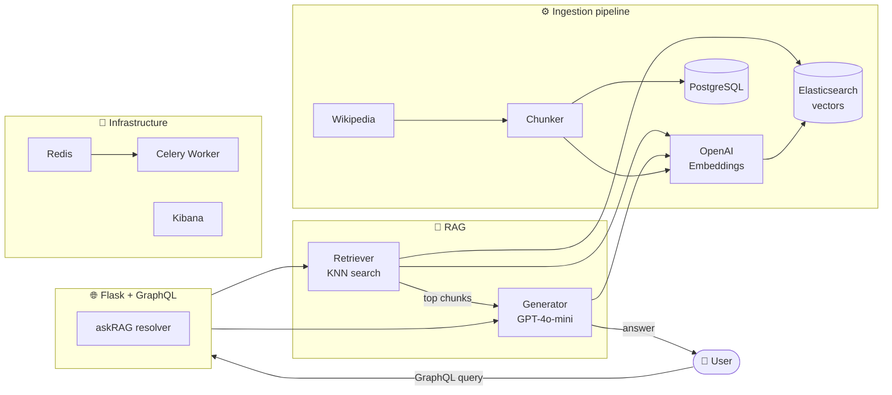

# Dubai Explorer AI 🏙️
> A production-grade RAG (Retrieval-Augmented Generation) backend system for Dubai travel Q&A — built with Flask, GraphQL, Elasticsearch, and OpenAI.


## 📌 Overview

Dubai Explorer AI is a **personal backend POC** that demonstrates a complete, production-style RAG system.

It answers natural language questions about Dubai attractions by:
1. Fetching and indexing Wikipedia articles into Elasticsearch as vector embeddings
2. Retrieving semantically relevant chunks at query time using KNN search
3. Generating grounded answers using OpenAI GPT-4o-mini — based **only** on retrieved context

This project was built to demonstrate hands-on expertise in **AI-integrated backend engineering**, distributed systems, and modern Python architecture.



## 🧰 Tech Stack

| Layer | Technology |
|---|---|
| **Backend** | Python 3.11, Flask, GraphQL (Graphene) |
| **AI / RAG** | OpenAI GPT-4o-mini, text-embedding-3-small, LangChain |
| **Vector Search** | Elasticsearch 8.14 (KNN vector index, 1536 dimensions) |
| **Database** | PostgreSQL 15 (source of truth), SQLAlchemy, Flask-Migrate |
| **Async** | Celery, Redis 7 (task broker + caching) |
| **Observability** | Kibana, Python structured logging (UTC-based) |
| **Containerization** | Docker, Docker Compose (7 services) |
| **External APIs** | Wikipedia API, OpenAI API, SendGrid |


## ⚙️ Local Setup

### Prerequisites
- Python 3.11+
- Docker Desktop
- OpenAI API Key (with credits)
- Git

### 1. Clone the repository
```bash
git clone https://github.com/lkum11/dubai-explorer-ai.git
cd dubai-explorer-ai
```

### 2. Configure environment variables
```bash
cp .env.example .env
```

Add these to your `.env`:
```
OPENAI_API_KEY=sk-...
DATABASE_URL=postgresql+psycopg://postgres:postgres@db:5432/appdb
REDIS_URL=redis://redis:6379/0
ELASTICSEARCH_URL=http://elasticsearch:9200
SENDER_EMAIL=your@email.com
SENDGRID_API_KEY=          # optional
```

### 3. Start the services
```bash
docker compose up --build
```

> ⚠️ Elasticsearch takes 30-60 seconds to be ready on first start.

### 4. Initialize database (first time only)
```bash
docker compose exec web flask db init
docker compose exec web flask db migrate
docker compose exec web flask db upgrade
```

### 5. Run the ingestion pipeline (first time only)
```bash
docker compose exec web python -m scripts.init_pipeline
```

This fetches Wikipedia articles, chunks, embeds, and indexes them into Elasticsearch.

### 6. Test the API
Visit `http://localhost:5000/graphql` and run:
```graphql
{
  askRAG(queryText: "What are the attractions at Palm Jumeirah?")
}
```

## 🎯 Key Design Decisions

**Why Elasticsearch over a managed vector DB (Pinecone, Weaviate)?**
Elasticsearch gives full control over the infrastructure, runs locally in Docker, and supports both vector and keyword search in one system. For a distributed backend POC, owning the stack matters more than convenience.

**Why PostgreSQL AND Elasticsearch?**
PostgreSQL is the source of truth — raw articles and chunks are always preserved. If the Elasticsearch index is deleted or the embedding model changes, data can be re-indexed from PostgreSQL without re-fetching from Wikipedia.

**Why GPT-4o-mini over GPT-4o?**
Cost efficiency. For a RAG system that generates answers at query time, the cost difference is significant at scale. GPT-4o-mini produces high-quality responses for factual Q&A tasks where context is already retrieved.

**Why idempotent pipeline design?**
Each stage tracks its own state (`is_chunked`, `is_embedded`, `is_indexed` flags). The pipeline can be re-run safely at any time — it skips already-processed data. This is critical for production systems where partial failures are common.

**Why Celery + Redis?**
Decouples async tasks (email, background jobs) from the request lifecycle. Redis serves dual purpose — Celery broker and response caching layer.

## ⚠️ Known Limitations & Future Improvements

- **Data scope**: Currently indexes 10 Wikipedia articles. Production would use a richer, curated dataset.
- **No query caching**: Identical queries hit OpenAI every time. Redis caching is scaffolded but not yet implemented.
- **No RAG evaluation**: Retrieval quality is not formally measured. Future work: add RAGAS or similar eval framework.
- **No authentication**: GraphQL endpoint is open. Production would require API key or JWT auth.
- **Single-node Elasticsearch**: TLS and multi-node config is available but disabled for local dev simplicity.
- **No streaming responses**: Answers are returned as complete strings. Future work: stream tokens via WebSocket or SSE.
- **Chatbot module**: Prototype session-based chat under `app/chatbot/` — not yet integrated with RAG pipeline.

## 🤖 v2 — Agentic Self-Correcting RAG

The pipeline was upgraded from a fixed RAG system to a 
self-correcting agentic system using LangGraph.

### What Changed:

Instead of blindly trusting every GPT response, the system 
now checks its own answers before returning them.

### Flow:

## 👩‍💻 Author

**Lovely Kumari** — Senior Python Backend Engineer  
📍 Dubai, UAE | Available immediately  
🔗 [LinkedIn](https://linkedin.com/in/lovely-kumari-1855ba4b) | 
🐙 [GitHub](https://github.com/lkum11/dubai-explorer-ai)  
📧 joinlovely@gmail.com