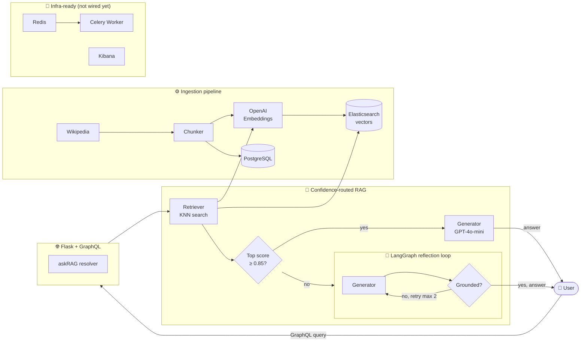

# Dubai Explorer AI 🏙️
> A production-style RAG backend for Dubai travel Q&A, with a self-correcting LangGraph verification loop. Built with Flask, GraphQL, Elasticsearch and OpenAI.


## 📌 Overview

Dubai Explorer AI answers natural-language questions about Dubai attractions, grounded only in content it has indexed. It:

1. Fetches Wikipedia articles, chunks them, embeds them and indexes them into Elasticsearch
2. Retrieves the most relevant chunks at query time with KNN vector search
3. Generates an answer with GPT-4o-mini using only the retrieved context
4. Routes by retrieval confidence: strong matches are answered directly, while weak matches go through a LangGraph reflection loop that checks the answer is grounded and regenerates if it isn't

It's secured with JWT auth, covered by 21 automated tests, and runs as a 7-service Docker Compose stack with CI on every push.

## 🏗️ Architecture


```mermaid
flowchart LR
    User(["👤 User"])

    User -->|"GraphQL query"| Flask

    subgraph Flask ["🌐 Flask + GraphQL"]
        askRAG["askRAG resolver"]
    end

    Flask --> Retriever

    subgraph RAG ["🧠 Confidence-routed RAG"]
        Retriever["Retriever\nKNN search"] --> Router{"Top score\n≥ 0.85?"}
        Router -->|"yes"| Direct["Generator\nGPT-4o-mini"]
        Router -->|"no"| Agentic

        subgraph Agentic ["🤖 LangGraph reflection loop"]
            Generator["Generator"] --> Verify{"Grounded?"}
            Verify -->|"no, retry max 2"| Generator
        end
    end

    Retriever --> ES[("Elasticsearch\nvectors")]
    Retriever --> OpenAI["OpenAI\nEmbeddings"]

    Direct -->|"answer"| User
    Verify -->|"yes, answer"| User

    subgraph Ingestion ["⚙️ Ingestion pipeline"]
        direction LR
        Wikipedia --> Chunker --> PostgreSQL[("PostgreSQL")]
        Chunker --> OpenAI
        OpenAI --> ES
    end

    subgraph Infra ["🔧 Infra-ready (not wired yet)"]
        direction LR
        Redis --> Celery["Celery Worker"]
        Kibana["Kibana"]
    end
```

## 🤖 Self-correcting RAG (v2)

The first version trusted every GPT response. v2 adds **confidence-based routing** in front of generation:

- **High confidence (top retrieval score ≥ 0.85):** the retrieved context is a strong match, so the system generates the answer directly. No extra LLM calls.
- **Low confidence (below 0.85):** the answer goes through a LangGraph graph that implements the **Reflection pattern**. After generating, a verification step checks whether the answer is grounded in the retrieved context. If it isn't, the graph loops back and regenerates, capped at two retries so a hard question can't loop forever.
- **No chunks retrieved:** the system says it doesn't have enough information instead of letting the model answer from its training data.

This keeps the common case fast and cheap, and spends extra verification only where hallucination risk is highest.

I chose Reflection over a ReAct-style agent on purpose. The retrieval path is fixed, so the system doesn't need an agent that decides which tools to call. It only needs a quality gate before the answer goes out.

## 🧰 Tech Stack

| Layer | Technology |
|---|---|
| **Backend** | Python 3.11, Flask, GraphQL (Graphene) |
| **AI / RAG** | OpenAI GPT-4o-mini, text-embedding-3-small (1536 dims), LangGraph |
| **Vector search** | Elasticsearch 8.14 (KNN, HNSW index, cosine similarity) |
| **Database** | PostgreSQL 15 (source of truth), SQLAlchemy, Flask-Migrate |
| **Auth** | JWT, bcrypt password hashing, UUID primary keys |
| **Testing & CI** | pytest (21 tests with conftest fixtures), GitHub Actions |
| **Containers** | Docker Compose (7 services, with Elasticsearch healthcheck) |
| **Infra-ready** | Redis 7 and Celery are in the stack for future caching and background jobs |

## ⚙️ Local Setup

### Prerequisites
- Python 3.11+
- Docker Desktop
- OpenAI API key (with credits)

### 1. Clone the repository
```bash
git clone https://github.com/lkum11/dubai-explorer-ai.git
cd dubai-explorer-ai
```

### 2. Configure environment variables
```bash
cp .env.example .env
```

Add these to your `.env`:
```
OPENAI_API_KEY=sk-...
DATABASE_URL=postgresql+psycopg://postgres:postgres@db:5432/appdb
REDIS_URL=redis://redis:6379/0
ELASTICSEARCH_URL=http://elasticsearch:9200
SENDER_EMAIL=your@email.com
SENDGRID_API_KEY=          # optional
```

### 3. Start the services
```bash
docker compose up --build
```

> ⚠️ Elasticsearch takes 30 to 60 seconds to be ready on first start. The web service waits for its healthcheck.

### 4. Apply database migrations (first time only)
```bash
docker compose exec web flask db upgrade
```

### 5. Run the ingestion pipeline (first time only)
```bash
docker compose exec web python -m scripts.init_pipeline
```

This fetches Wikipedia articles, chunks, embeds and indexes them into Elasticsearch.

### 6. Get a token and query
Register a user, then log in to get a JWT:
```bash
curl -X POST http://localhost:5000/auth/register \
  -H "Content-Type: application/json" \
  -d '{"username": "demo", "email": "demo@example.com", "password": "demo1234"}'

curl -X POST http://localhost:5000/auth/login \
  -H "Content-Type: application/json" \
  -d '{"email": "demo@example.com", "password": "demo1234"}'
# response includes "token"
```

Then open `http://localhost:5000/graphql`, send the token as `Authorization: Bearer <token>`, and run:
```graphql
{
  askRAG(queryText: "What are the attractions at Palm Jumeirah?")
}
```

### 7. Run the tests
```bash
docker compose exec web pytest
```

## 🎯 Key Design Decisions

**Why Elasticsearch over a managed vector DB (Pinecone, Weaviate)?**
It runs locally in Docker, gives full control of the infrastructure, and supports both vector and keyword search in one system.

**Why PostgreSQL and Elasticsearch?**
PostgreSQL is the source of truth, so raw articles and chunks are always preserved. If the index is deleted or the embedding model changes, everything can be re-indexed from PostgreSQL without re-fetching from Wikipedia.

**Why an idempotent pipeline?**
Each stage tracks its own state (`is_chunked`, `is_embedded`, `is_indexed`). The pipeline can be re-run safely at any time and skips work already done, which matters when partial failures are common.

**Why GPT-4o-mini over GPT-4o?**
Cost. The context is already retrieved, so the model only has to write a grounded answer from it, and the smaller model handles that well at a fraction of the price.

**Why Reflection instead of a full agent?**
See the v2 section above. The flow is fixed, so a quality gate adds value where tool-choosing autonomy wouldn't.

## ⚠️ Known Limitations & Next Steps

- **Small dataset:** 10 Wikipedia articles. A real system would use a larger curated corpus.
- **No formal RAG evaluation yet:** the 0.85 routing threshold comes from researched best practice, not a golden-set experiment. Adding a golden set and faithfulness scoring is the next step.
- **No re-ranking or citation enforcement:** retrieved chunks go straight to generation.
- **Redis and Celery are not wired to features yet:** query caching and background jobs are scaffolded but not implemented.
- **Not deployed:** an AWS EC2 t3.micro attempt ran out of memory because of Elasticsearch's requirements. A bigger instance or a managed search service would fix this.
- **No streaming:** answers come back as complete strings.

## 👩‍💻 Author

**Lovely Kumari**, Senior Python Backend Engineer
📍 Dubai, UAE
🔗 [LinkedIn](https://linkedin.com/in/lovely-kumari-1855ba4b) · 📧 joinlovely@gmail.com
